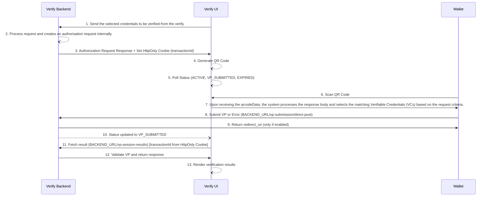

# OpenID4VP - Online Sharing Cross Device Flow

Inji Verify supports the OpenID for Verifiable Presentations (OpenID4VP) specification (Draft 23). This document provides a comprehensive overview of the cross-device flow, where a verifier initiates a request and a wallet generates and submits a Verifiable Presentation (VP) in response.

The implementation adheres to the OpenID4VP [specification](https://openid.net/specs/openid-4-verifiable-presentations-1_0-23.html) and defines how Verifiable Credentials (VCs) are requested, presented, and verified.

## Specifications supported
- OpenID for Verifiable Presentations – [Draft 23 🔗](https://openid.net/specs/openid-4-verifiable-presentations-1_0-23.html).
- Presentation Exchange 2.0.0 [specification 🔗](https://identity.foundation/presentation-exchange/spec/v2.0.0)
- Supported VC format: LDP VC, SD-JWT VC, CWT VC

## API Documentation
API documentation is available in the [Inji Verify API documentation 🔗](https://mosip.stoplight.io/docs/inji-verify/branches/main/).

## Functionalities
### Authorization Request Creation:
- Inji Verify sends the selected credentials to the backend for verification. The backend service generates the authorization request body and returns the response in the form of a QR code.
- The QR code is scanned by the wallet to initiate the VP flow.
    - Required fields for creating an authorization request:
        - client_id
        - **_presentationDefinitionId_** or **_presentationDefinition_** (presentationDefinition - should adhere to the [Specification 🔗](https://identity.foundation/presentation-exchange/spec/v2.0.0)
        - transactionId (Optional) - If not provided, it will be generated by the server, base64-encoded, and set as an HTTP-only secure cookie in the response header.

### Authorization Request Status:
- Inji Verify provides an API to fetch the current status of an authorization request.
    - Possible statuses:
        - **_ACTIVE_** - Authorization request is created and awaiting VP submission.
        - **_VP_SUBMITTED_** - A VP has been successfully submitted.
        - **_EXPIRED_** - No VP was submitted within the allowed time.
- This API uses long polling with a timeout of one minute.

### Verifiable Presentation Submission:
- Inji Verify provides an API for submitting Verifiable Presentations (VPs).
- After scanning the QR code:
    - The wallet processes the request
    - Selects matching Verifiable Credentials (VCs)
    - Generates a VP token
    - Submits the VP along with the request to the backend
- If an error occurs during VP generation, the wallet submits the error and its description to the backend.

> **Important Implementation Note**
>
> The submission endpoint may return a redirect_uri depending on the responseCodeValidationRequired configuration:
>
> If responseCodeValidationRequired = true
>
> A redirect_uri is returned.
>
> It contains a response_code used by the UI to resume the flow, display results, handle errors, or terminate the session.
>
> If responseCodeValidationRequired = false
>
> No redirect_uri is returned.
>
> **Cross-Device Flow Behavior**
>
> For cross-device flows, responseCodeValidationRequired is always set to false.
> Therefore, no redirect_uri is returned in this flow.

### Submission Result:
- Once the wallet submits the VP, the request status is updated to VP_SUBMITTED.
- The Inji Verify UI retrieves the verification result using backend APIs.
- Response Includes:
    1. Overall verification status
    * **_SUCCESS_**
    * **_FAILED_**
    2. Credential-level results
    - Each VC included in the VP is verified independently with the following possible statuses:
    * **_SUCCESS_**
    * **_INVALID_**
    * **_EXPIRED_**
    * **_REVOKED_**

  During revocation checks, if the verifier encounters an error, an exception with a descriptive message is returned and displayed in the UI.

- Result Format Configuration

  A new attribute summariseResults has been introduced.

  This attribute determines the format of the response returned by the SDK.

    - When summariseResults = true

      The SDK returns a simplified, high-level response:

      ```json
      {
        "vcResults": [
          {
            "vc": { /* Verified Credential data */ },
            "vcStatus": "SUCCESS" // or "INVALID", "EXPIRED"
          }
        ],
        "vpResultStatus": "SUCCESS" // Overall verification status
      }
      ```

    - When summariseResults = false

      The SDK returns a detailed response with full verification breakdown:

      ```json
      {
        "transactionId": "txn_11",
        "allChecksSuccessful": true,
        "credentialResults": [
          {
            "verifiableCredential": "{...}",
            "allChecksSuccessful": true,
            "holderProofCheck": { "valid": true, "error": null },
            "schemaAndSignatureCheck": { "valid": true, "error": null },
            "expiryCheck": { "valid": true },
            "statusChecks": [
              { "purpose": "revocation", "valid": true, "error": null },
              { "purpose": "suspension", "valid": true, "error": null }
            ],
            "claims": { /* Extracted claims */ }
          }
        ]
      }
      ```

## Sequence Diagram

