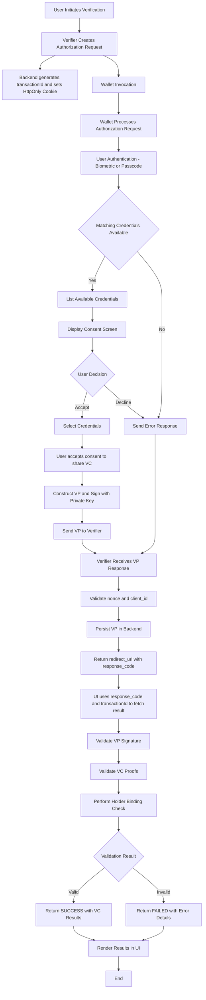

# OpenID4VP - Online Sharing Same Device Flow

## Same Device Flow
### Description of the Flow
The Same Device Flow in OpenID for Verifiable Presentations (OpenID4VP) enables interaction between a verifier and a wallet application running on the same device.

Unlike the cross-device flow (which relies on QR code scanning), this flow uses application redirection mechanisms to exchange the authorization request and response between the verifier and the wallet.

### Key Steps in the Flow
1. **Initiation**: The flow begins when a user initiates a verification request from the verifier application.
- This may occur when:
    - The user chooses to verify credentials, or
    - The application requests credential presentation

2. **Authorization Request**: The verifier constructs an authorization request containing the following parameters:
    * **response_type**: Specifies the type of response expected from the authorization server(wallet) for example in our case response_type = vp_token
    * **Client_id**: The unique identifier for the client (Verifier) application making the request
    * **request_uri**: This is a URL where the verifier application directs the Wallet to retrieve the actual Authorization Request, used when the request object is too large to be transmitted directly, helping to keep the Request Object size smaller.
    * **response_mode**: This parameter tells the wallet that how it should send the vp_token to the verifier application

      | Response Mode         | Description|
           | --------------------- | ----------------------------------------------------------------------------------------------------------------------------------------------------------------------------------------------------------------------------------------------------------------------------------------------------------------------------------------------------------------------------------------------------------------------------------------------------------------------------------------------------------------------------------- |
      | Direct Post (Default) | Response will be sent to verifier using HTTP POST request and response body will be encoded with content type `application/x-www-form-urlencoded`. <br/> - Response is sent to `response_uri` controlled by the verifier. <br/> - Verifier fetches the `vp_token` using transaction-id. <br/> - Verifier provides `response_uri` in Authorization request. |
      | Fragment              | Response will be encoded in the Fragment added to the redirect_uri and will be sent to the verifier when redirecting the end-user back to the verifier
    * **response_uri**- if verifier send the response mode as Direct post, then verifier is expecting the response to be sent to some resource which will be under the control of the verifier and verifier will get the response from this response-uri.
    * **presentation_definition** (Required)- It is an JSON object which contains the info about the credentials that are being requested by the verifier.
    * **presentation_definition_uri** - to reduce the size of the request or QR code sometimes the verifier stores the presentation_definition Json object at some resource endpoint and sends that resource uri to wallet and wallet call this endpoint and gets the presentation definition object.
    * **client_id_scheme** - this value used by the Verifier to tell wallet about how it needs to interpret the client identifier provided by the verifier based on the scheme selected.
    * **client_metadata** - Json object which contains the verifier metadata
    * **state** - It contains request-id, and it is a random value generated by verifier cryptographically, and it is used for binding the Authorization request and response.
    * **nonce** - It is a random value generated by verifier cryptographically and used for preventing the replay attacks. Here this random value will be bound to the authorization response so that even if attacker intercepts the VP response, they cannot replay the VP response again.
    * **responseCodeValidationRequired** - Boolean flag indicating whether response_code validation is required.

**Session Handling**

- A transactionId may be optionally included in the authorization request. If it is not provided, the backend automatically generates one.
- The generated transactionId is base64-encoded and returned as an HTTP-only secure cookie in the response header. This cookie is used by the verifier to retrieve and correlate the corresponding VP result for the session.

3. **Request Transmission**: The constructed authorization request is sent directly to the wallet application on the same device. This transmission can occur via a custom URL scheme or domain-bound links, depending on the implementation.
   The Authorization Request can be of by value or by reference
   Then the Wallet app is invoked, and the authorization Request is passed to it

4. **User Consent**: Upon receiving the request, the wallet displays a consent page to the user which has the options to accept or decline the request.

   Once the user accepts to share the credentials to the verifier application wallet proceeds to create a verifiable presentation, if the user declines the request, then the wallet prompts a reason or simply cancel request

5. **Authorization Response**: After the user accepts the request then wallet checks for the credentials which matches as per the presentation definition (which the verifier requested for) and if there are any wallet shows the list to the user allowing them to select, and then it constructs a VP response and signs using its private key.

    * **Response Parameters**:
      The response Parameters may have
        * **vp_token** - JSON string or object which contains either a single VP or array of VPs. Each VC in every VP can be either encoded using base64url or sent as JSON object.
        * **presentation_submission** - It contains mappings between the requested Verifiable Credentials and where to find them within the returned VP Token.

      Or
        * **error** - String to allow the wallet to report errors.
        * **errorDescription** - String which contains human readable description about the error reported by wallet.

      And
        * **other parameters include** - state(**request-id**), code, id_token

6. **Transmission of Authorization Response**: Once the Wallet prepares the VP, Wallet sends it back to verifier application (using redirect URI) based on the response_mode and the response_type specified by the verifier application in the Authorization Request.

   Upon receiving the VP, the verifier validates the nonce and client_id against the original authorization request to ensure integrity and prevent replay attacks. After successful validation, the VP is persisted in the backend for further processing.

> **Important Implementation Note**
>
> The submission endpoint may return a **_redirect_uri_** depending on the **_responseCodeValidationRequired_** configuration:
>
> If **_responseCodeValidationRequired_** = true
>
> A redirect_uri is returned.
>
> It contains a response_code used by the UI to resume the flow, display results, handle errors, or terminate the session.
>
> If **_responseCodeValidationRequired_** = false
>
> No redirect_uri is returned.
>
> **Same-Device Flow Behavior**
>
> For same-device flows, responseCodeValidationRequired should typically be set to `true` by the client/UI (e.g., web wallet) to ensure proper response validation.

7. **Validation of the Authorization Response**: Upon receiving the Authorization Response from the wallet, the verifier validates the signature of the Verifiable Presentation (VP) using the wallet’s public key. It then verifies each Verifiable Credential (VC) by validating the issuer’s proof details.After successful proof validation, the verifier performs a holder binding check to ensure that the VP is presented by the legitimate holder of the credentials.The Verifier UI uses the response_code along with the transactionId (retrieved from the HTTP-only cookie) to securely fetch the verification results.

- The final result returned to the Verify UI contains:
    - The overall submission status: SUCCESS or FAILED
    - A list of VCs with their individual verification statuses: SUCCESS, INVALID, EXPIRED, or REVOKED.   
      During the revocation check, if the vc_verifier encounters any error, it returns an exception with a descriptive error message, which the Verify UI displays to the user.

- Result Format Configuration

  A new attribute summariseResults has been introduced.

  This attribute determines the format of the response returned by the SDK.

    - When summariseResults = true

      The SDK returns a simplified, high-level response:

      ```json
      {
        "vcResults": [
          {
            "vc": { /* Verified Credential data */ },
            "vcStatus": "SUCCESS" // or "INVALID", "EXPIRED"
          }
        ],
        "vpResultStatus": "SUCCESS" // Overall verification status
      }
      ```

    - When summariseResults = false

      The SDK returns a detailed response with full verification breakdown:

      ```json
      {
        "transactionId": "txn_11",
        "allChecksSuccessful": true,
        "credentialResults": [
          {
            "verifiableCredential": "{...}",
            "allChecksSuccessful": true,
            "holderProofCheck": { "valid": true, "error": null },
            "schemaAndSignatureCheck": { "valid": true, "error": null },
            "expiryCheck": { "valid": true },
            "statusChecks": [
              { "purpose": "revocation", "valid": true, "error": null },
              { "purpose": "suspension", "valid": true, "error": null }
            ],
            "claims": { /* Extracted claims */ }
          }
        ]
      }
      ```

Flow Chart:


### Brief on Wallet Invocation
In the Case of the Cross Device flow the wallet Invocation happens manually that is end user opens the Wallet manually and scans the QR code that contains the Authorization request post that wallet flow continuous but in the case of the same device flow the wallet invocation happens in either of the two ways and they are

1. **Custom URL Scheme as an Authorization Endpoint**

2. **Domain-bound Universal Links/App Links as an Authorization Endpoint**


#### Wallet Invocation through Custom URL Scheme
* **Description**: The Verifier can invoke the Inji Wallet app directly using a **custom URL scheme (openid4vp://)**. This mechanism allows the Wallet to be triggered without requiring domain-bound universal links.
  The Wallet is configured to recognize the scheme openid4vp:// with the host authorize. When the Verifier sends an authorization request, it redirects the user to a URL using this scheme, triggering the Wallet to open and handle the request.

* **How it works**: The Verifier generates a URL with the custom scheme, which, when clicked, will open the Wallet app on the same device. If the Wallet app is installed, the app will handle the request; otherwise, an error or fallback action is triggered.

```
Example using Custom URL Scheme:
openid4vp://authorize?token=xyz123
```

#### Wallet Invocation through Domain-bound Universal Links/App

* **Description**: This method uses **Universal Links (iOS)** or **App Links (Android)** as the `authorization_endpoint`. Universal Links/App Links are deep links that open the Wallet app directly when the link is clicked. If the app is installed, it will launch; if it’s not installed, the link will fall back to a web-based page or prompt to download the app.

* **How it works**: The Verifier sends a URL associated with a domain. If the Wallet app is installed, the link opens the app directly. If not, the user is directed to a fallback web page.

```
Example using Domain-bound Universal Links/App:
openid4vp://authorize?token=xyz123
```